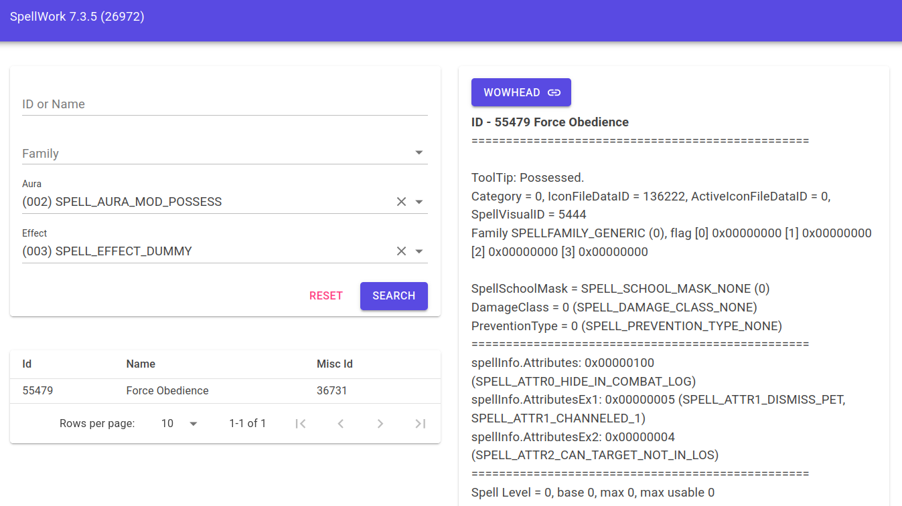

SpellWork
=========

SpellWork is a tool to browse and display information about World of Wacraft spells.
It is implemented in .NET and it runs in the browser.

History
-------

SpellWork is a tool originally created by Chestr (also known as DiSlord).

This project is a try to rebuild the application using C#.

Thanks goes to:

- Chestr (for the idea and released source of original spell_work)
- TOM_RUS (for code samples)
- Shauren (updating for TrinityCore)
